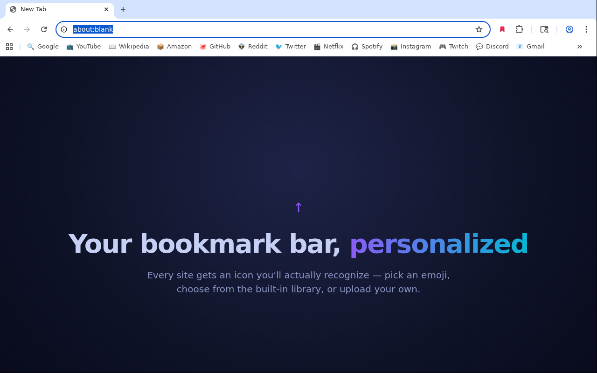
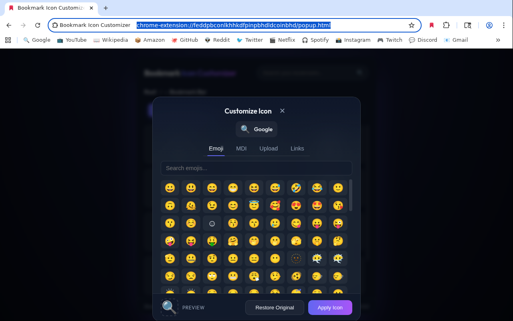
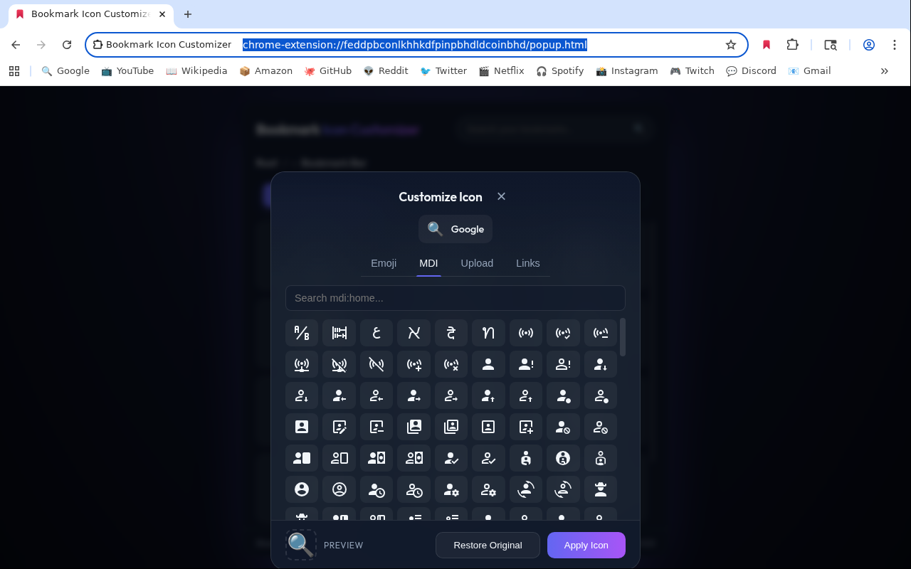

# Bookmark Icon Customizer

A Chrome extension that lets you replace any bookmark's favicon with an emoji, a Material Design Icon (14,000+ glyphs), or your own image. Works with plain URLs, `javascript:` bookmarklets, and webhooks.

**[➕ Add to Chrome — Chrome Web Store](https://chromewebstore.google.com/detail/bookmark-icon-customizer/fhngdjipelbebhdnkpealakcckpjpjpn)** · [Website](https://mayerwin.github.io/Bookmark-Icon-Customizer/)

## Features

- **Emoji picker** — high-DPI (128×128) rendering for crisp, vibrant icons.
- **Material Design Icons** — 14,000+ searchable glyphs.
- **Image upload** — PNG, JPG, or ICO files.
- **Bookmarklets (`javascript:`)** — rewritten to a launcher URL that carries a custom favicon while preserving the original source (recoverable even if the extension is uninstalled).
- **Webhooks** — tick a box to turn a URL into a silent fire-and-forget fetch. The bookmark behaves like a button: no tab, no navigation, custom icon.
- **Self-healing** — bookmarklets converted by a prior install automatically revert to `javascript:` form if storage is wiped or the extension ID changes.
- **Glass dark UI** — Outfit font, coral/crimson accents, smooth micro-animations.
- **Local-only storage** — icon mappings live in `chrome.storage.local`. No servers, no telemetry. See [PRIVACY.md](PRIVACY.md).

## How it works

Chrome's favicon cache is keyed by URL and doesn't expose an API to set icons directly. The extension handles this with two strategies:

- **Plain URLs** — the extension loads the bookmark target once in a small focused-off popup window so Chrome caches the favicon you picked for that URL.
- **Bookmarklets and webhooks** — the bookmark URL is rewritten. Bookmarklets become `chrome-extension://<id>/launcher.html?js=<encoded>` so the launcher page can carry a favicon; webhooks become a `data:text/html` URL with the favicon inlined (Chrome ignores `<link rel="icon">` on `chrome-extension://` bookmarks, so `data:` is required for webhooks).

Both rewrites are fully reversible — untick the customization and the bookmark is restored to its original form.

## Installation

**From the Chrome Web Store (recommended):** [Add to Chrome](https://chromewebstore.google.com/detail/bookmark-icon-customizer/fhngdjipelbebhdnkpealakcckpjpjpn).

**From source (development):**

1. Clone this repository.
2. Open `chrome://extensions/` and enable **Developer mode**.
3. Click **Load unpacked** and select the repository folder.
4. Pin the extension and click its icon to start customizing.

## Screenshots

| Emoji picker | MDI picker |
|---|---|
|  |  |

## License

MIT — see [LICENSE](LICENSE).
