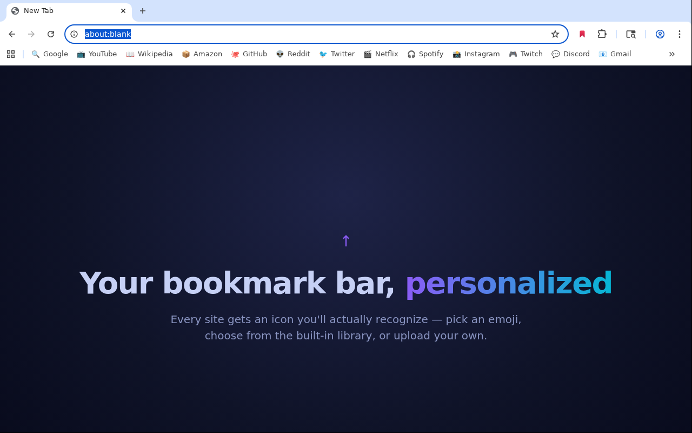
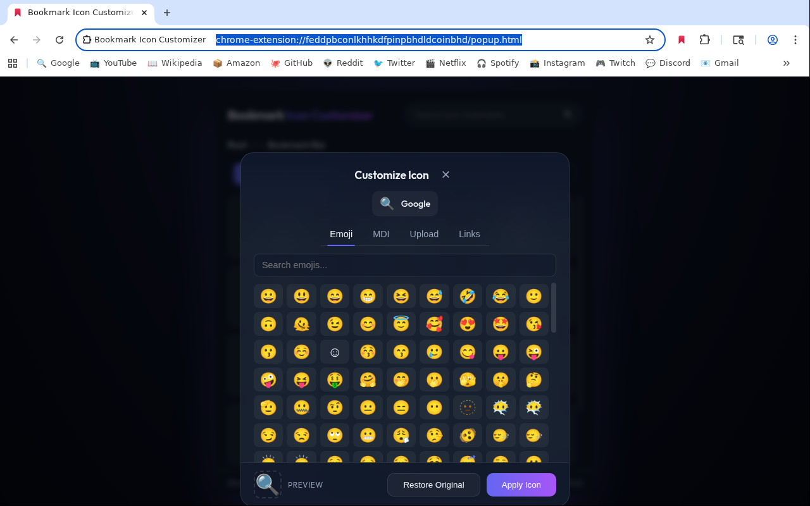
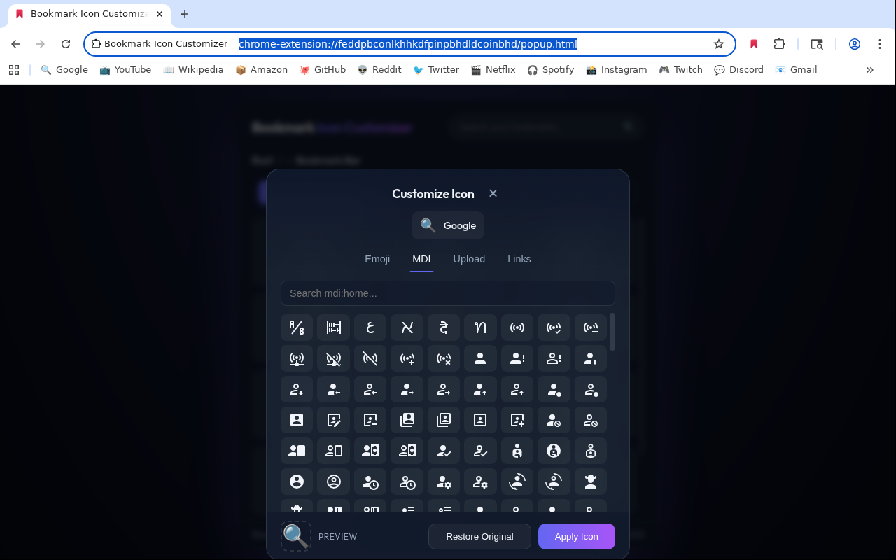

# Bookmark Icon Customizer

A Chrome extension that lets you replace any bookmark's favicon with an emoji, a Material Design Icon (14,000+ glyphs), or your own image. Works with plain URLs, `javascript:` bookmarklets, and webhooks.

**[➕ Add to Chrome — Chrome Web Store](https://chromewebstore.google.com/detail/bookmark-icon-customizer/fhngdjipelbebhdnkpealakcckpjpjpn)** · [Website](https://mayerwin.github.io/Bookmark-Icon-Customizer/)

## Features

- **Emoji picker** — high-DPI (128×128) rendering for crisp, vibrant icons.
- **Material Design Icons** — 14,000+ searchable glyphs.
- **Image upload** — PNG, JPG, or ICO files.
- **Bookmarklets (`javascript:`)** — rewritten to a launcher URL that carries a custom favicon while preserving the original source (recoverable even if the extension is uninstalled). Two modes (see below): **page-inject** for bookmarklets that modify the current page, **sandbox** for fire-and-forget ones.
- **Webhooks** — tick a box to turn a URL into a silent fire-and-forget fetch. The bookmark behaves like a button: no tab, no navigation, custom icon.
- **Self-healing** — bookmarklets converted by a prior install automatically revert to `javascript:` form if storage is wiped or the extension ID changes.
- **Glass dark UI** — Outfit font, coral/crimson accents, smooth micro-animations.
- **Local-only storage** — icon mappings live in `chrome.storage.local`. No servers, no telemetry. See [PRIVACY.md](PRIVACY.md).

## How it works

Chrome's favicon cache is keyed by URL and doesn't expose an API to set icons directly. The extension handles this with two strategies:

- **Plain URLs** — the extension loads the bookmark target once in a small focused-off popup window so Chrome caches the favicon you picked for that URL.
- **Bookmarklets and webhooks** — the bookmark URL is rewritten to a `data:text/html` URL with the favicon inlined directly inside the HTML. (Chrome ignores `<link rel="icon">` on `chrome-extension://` URLs and substitutes the manifest icon, so a real `data:` URL is the only way to carry a custom favicon on a non-http bookmark.)

Both rewrites are fully reversible — untick the customization and the bookmark is restored to its original form.

### Bookmarklet sub-modes

A native `javascript:` bookmarklet runs **inside the page you click it from** — that's what lets it add buttons, edit content, read the selection, fill forms, etc. The catch is that Chrome doesn't show favicons for `javascript:` URLs. To attach a custom icon, this extension has to rewrite the bookmark to a real URL. Two modes, chosen by the picker's **"Run on the current page"** checkbox:

- **Checked (page-inject mode, default for new bookmarklets)** — when you click the bookmark, the tab navigates to a `data:text/html` URL the extension built. That URL's inline script immediately calls `history.back()`, sending the user straight back to the page they came from. While the back-navigation is happening, the extension's background service worker (watching via `chrome.webNavigation`) extracts the bookmarklet source from the data: URL and runs it on the returned page via `chrome.scripting.executeScript({ world: 'MAIN' })`. End result: the bookmarklet operates on the page you clicked it from, the same as a native `javascript:` URL would. **Requires `<all_urls>` host permission** (the extension asks once the first time you apply an icon to a bookmarklet in this mode).

- **Unchecked (sandbox mode)** — the bookmarklet runs inside the data: URL's own document, isolated from your previous page. Useful for fire-and-forget bookmarklets that don't need to read or modify the current page (open a URL, log to the console, send a `fetch()`). Does **not** work for DOM-modifying bookmarklets. No extra permission requested.

You can switch modes any time by opening the picker on the converted bookmark and toggling the checkbox. "Restore Original" reverts the bookmark to its raw `javascript:` URL regardless of mode.

#### Known limitation of page-inject mode: page reload on BFCache-ineligible pages

Page-inject mode works by navigating the tab away to the data: URL and immediately back — a round-trip Chrome handles in ~100 ms. **Whether you see a visible reload depends on Chrome's back-forward cache (BFCache).** For most modern pages (news sites, Wikipedia, GitHub, Reddit, most apps), BFCache restores the previous page from memory: every click is a brief flash followed by a state-preserving return — same DOM nodes, same JavaScript variables, same scroll position, same form values.

For pages that **opt out of BFCache**, every click does a full fresh fetch of the previous URL — and any unsaved data on the page is lost. Common opt-outs:

- Pages with a `beforeunload` handler (rich editors, online IDEs, dashboards that warn before navigation).
- Pages with `Cache-Control: no-store`.
- Some banking and SSO pages.
- Pages with certain service-worker configurations.

The most painful subtlety: many editors only enable their `beforeunload` handler **once you have unsaved changes**, which is exactly when you'd most regret losing them. If your bookmarklet is targeting that kind of page, prefer not converting it to a custom-icon bookmark — keep it as a raw `javascript:` URL (the picker's "Restore Original" button reverts a converted bookmark). Sandbox mode has the same reload behavior as page-inject mode because both rewrite the bookmark to a `data:` URL; the only no-reload alternative is to leave the bookmark as `javascript:` and accept the default Chrome favicon.

Pages with very strict Content-Security-Policy `script-src` directives (those without `'unsafe-inline'`) will also block the injected script — that's a CSP property native `javascript:` URLs also can't get around, not a regression.

## Installation

**From the Chrome Web Store (recommended):** [Add to Chrome](https://chromewebstore.google.com/detail/bookmark-icon-customizer/fhngdjipelbebhdnkpealakcckpjpjpn).

**From source (development):**

1. Clone this repository.
2. Open `chrome://extensions/` and enable **Developer mode**.
3. Click **Load unpacked** and select the repository folder.
4. Pin the extension and click its icon to start customizing.

## Screenshots

| Emoji picker | MDI picker |
|---|---|
|  |  |

## License

MIT — see [LICENSE](LICENSE).
